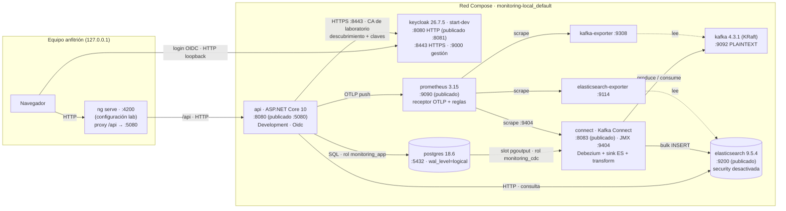
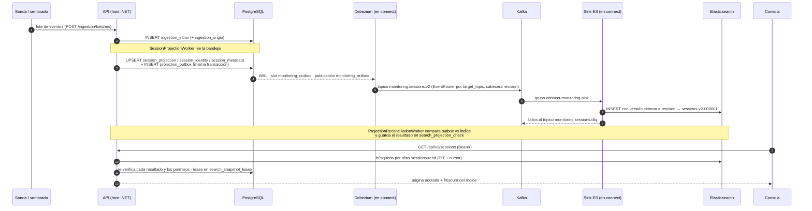
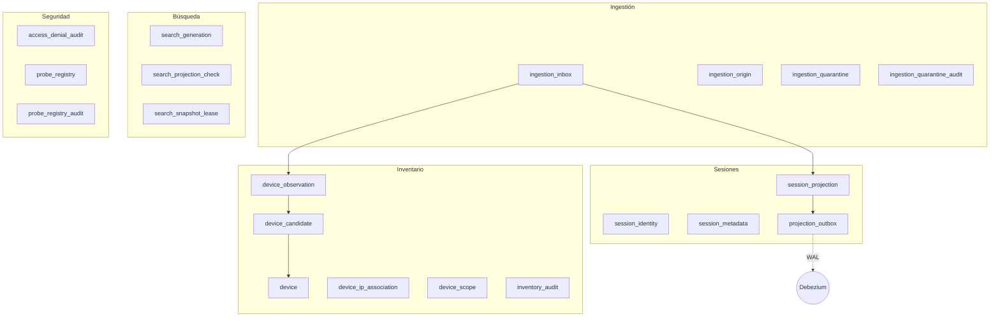
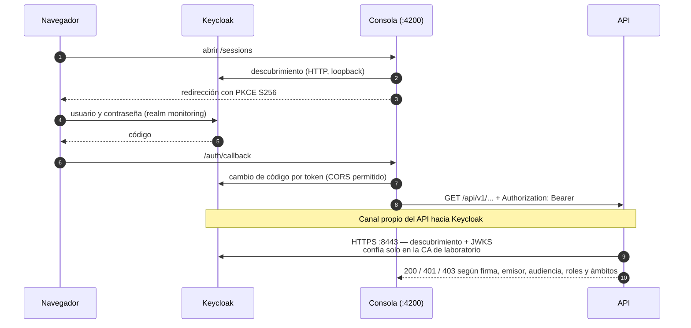
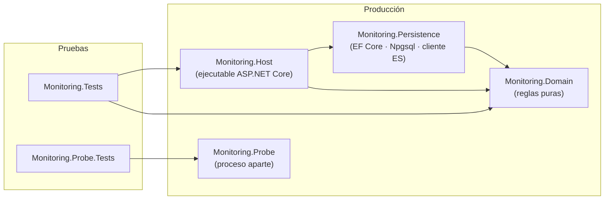
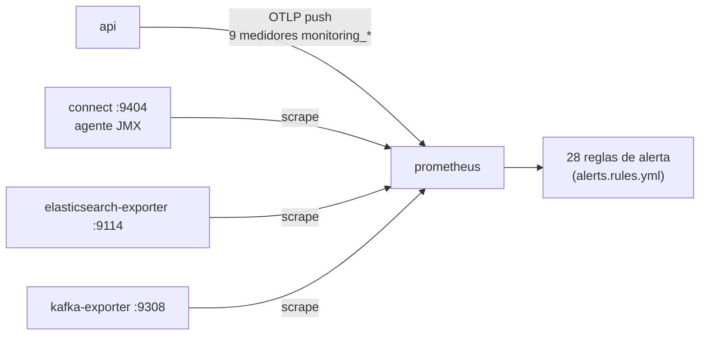

# Arquitectura real (observada)

Diagrama de lo que **existe y corre de verdad**, levantado a partir del sistema en ejecución y del código. No se ha consultado ninguna documentación del repositorio (ni ADR, ni guías, ni `stack.md`): si algo aquí contradice un documento, manda esto, porque se midió. Medición del 2026-10-07 sobre el proyecto Compose `monitoring-local`.

**Cómo se obtuvo** (reproducible):

| Dato | Fuente |
|---|---|
| Contenedores, imágenes, puertos, estado | `docker ps`, `docker network inspect monitoring-local_default` |
| Dependencias, perfiles, variables, secretos | `docker compose … config --format json` (todos los solapamientos y perfiles activos) |
| Tablas, publicación y slot de replicación, roles y conexiones | `psql` contra `monitoring`: `information_schema`, `pg_publication`, `pg_replication_slots`, `pg_stat_activity` |
| Conectores | `GET :8083/connectors/<n>/config` |
| Tópicos y grupos de consumo | `kafka-topics.sh --describe`, `kafka-consumer-groups.sh --list` |
| Índices y alias | `GET :9200/_cat/indices`, `/_alias` |
| Métricas y objetivos | API de Prometheus (`/targets`, `/label/job/values`, `/label/__name__/values`) |
| Procesos internos, endpoints, proyectos | código: `*.csproj`, `Program.cs`, `AddHostedService`, `Map*` |
| Keycloak: realm y cliente | `deploy/keycloak/realm-monitoring.json` y el descubrimiento en vivo |

---

## 1. Vista de contenedores

Nueve contenedores sanos en una única red (`monitoring-local_default`, 172.21.0.0/16). Solo cinco publican un puerto al equipo, todos ligados a `127.0.0.1`. La consola **no es un contenedor**: es `ng serve` en el equipo anfitrión.

### Inventario

| Contenedor | Imagen | Expuesto al equipo | Arranca tras | Notas |
|---|---|---|---|---|
| `api` | `monitoring/api` (aspnet 10.0.12) | `127.0.0.1:5080→8080` | `bootstrap`, `elasticsearch`, `keycloak` | Secretos: `postgres_app`, `lab_identity_ca` |
| `migrate` · `bootstrap` | misma imagen / `postgres` | — | `postgres` / `migrate` | Se ejecutan una vez y terminan con código 0 |
| `postgres` | `postgres:18.6` | — | — | Autoridad de datos. Tres roles (ver §3) |
| `kafka` | `apache/kafka:4.3.1` | — | — | Un nodo, replicación 1, retención 168 h |
| `connect` | `monitoring/connect` (Kafka + Debezium + sink + transform propio) | `127.0.0.1:8083` | `kafka` | Agente JMX de Prometheus en `:9404` |
| `elasticsearch` | `9.5.4` | `127.0.0.1:9200` | — | Un nodo, `xpack.security.enabled=false` |
| `keycloak` | `26.7.5` | `127.0.0.1:8081→8080` | — | HTTP y HTTPS activos a la vez |
| `prometheus` | `v3.15.0` | `127.0.0.1:9090` | — | Perfil `observability-lab` |
| `kafka-exporter` · `elasticsearch-exporter` | `v1.10.0` · `v1.11.0` | — | `kafka` · `elasticsearch` | Perfil `observability` |

---

## 2. Camino de un dato: de la bandeja al navegador

Es el flujo que se ejerce con los datos de demo. La entrada de datos es la **bandeja de ingestión en PostgreSQL**; esa bandeja la escribe `InboxWriter` cuando llega un lote por `POST /api/v1/ingestion/batches` (exige identidad de sonda: responde 401 sin credencial). En esta máquina **no hay ninguna sonda corriendo**, así que los datos entran por el sembrado, que escribe en la misma tabla.

Detalles observados:

- **Una sola escritura transaccional** hacia la autoridad y la cola de salida (`projection_outbox`): no hay doble escritura a Kafka.
- La publicación `monitoring_outbox` incluye **solo** la tabla `projection_outbox`; el slot usa `pgoutput` y está activo.
- El sink usa `write.method=INSERT` con versión externa (cabecera `revision`), `errors.tolerance=all` y tópico de cartas muertas; un `RegexRouter` lleva el tópico al índice `sessions-v2-000001`. El alias de lectura `sessions-read` apunta a ese índice.
- Estado medido: 175 documentos en el índice, 1 partición por tópico, grupo `connect-monitoring-sink` presente.

---

## 3. Autoridad de datos (PostgreSQL)

Un solo esquema `monitoring` con 20 tablas, agrupadas por responsabilidad:

| Rol de base de datos | Uso observado | Privilegios |
|---|---|---|
| `monitoring` | administración y arranque | superusuario y replicación (solo `bootstrap`, `psql`) |
| `monitoring_app` | **el API** (3 conexiones vivas) | sin superusuario ni replicación; permisos sobre las 20 tablas |
| `monitoring_cdc` | **Debezium** (2 conexiones «General» + 1 «Streaming») | replicación y **solo** `SELECT` sobre `projection_outbox` |

---

## 4. Identidad y confianza

- **Dos caminos distintos hacia Keycloak.** El navegador usa el HTTP de loopback (`127.0.0.1:8081`); el API usa HTTPS interno (`keycloak:8443`) validando la cadena contra la CA del laboratorio. El emisor que ve el token es el de loopback; los endpoints de canal trasero siguen el esquema y el host de quien pregunta.
- **Cliente `monitoring-web`**: público, PKCE S256, sin concesión directa. Tres mapeadores: `roles`, `monitoring_scopes` y la audiencia `monitoring-api`.
- **Roles** (`analista`, `auditor`, `administrador-inventario`) y cuatro usuarios sintéticos; el ámbito (`monitoring_scopes`) lo lleva cada token y lo aplica el API.
- **Claves**: el API las relee periódicamente y ante un identificador de clave desconocido, con espera acotada; una clave retirada deja de valer en minutos.
- **mTLS de sondas** está implementado en el código (`ProbeCertificateMiddleware`, `ProbeCertificateValidator`, `RevocationRefreshWorker`, tabla `probe_registry`) pero **no está activo en este laboratorio**: el API escucha solo HTTP en `:8080` y el endpoint de ingestión responde 401 sin identidad.

---

## 5. Por dentro del API (código)

Cuatro proyectos de producción. `Monitoring.Probe` es independiente: no referencia a los demás ni al revés.

**Hilos de fondo en el host** (`AddHostedService`):

| Servicio | Qué hace |
|---|---|
| `SessionProjectionWorker` | Convierte la bandeja en sesiones, identidad, metadatos y salida CDC |
| `ProjectionReconciliationWorker` | Compara la autoridad con el índice y registra faltantes/obsoletos |
| `RetentionWorker` | Retención de datos |
| `PipelineMetrics` · `QuarantineMetrics` | Publican contadores y medidores |
| `RevocationRefreshWorker` | Refresca la revocación de certificados de sonda (solo con mTLS configurado) |

**Modos de línea de comandos del mismo ejecutable:** `--migrate`, `--project-pending`, `--rebuild-search`, `--quarantine …`, `--probes …`, `--restore-finalize`.

**Superficie HTTP real:**

| Ruta | Método | Acceso |
|---|---|---|
| `/health/live` | GET | abierto |
| `/api/v1/sessions` · `/api/v1/sessions/{eventId}` | GET | token + rol + ámbito |
| `/api/v1/inventory/devices` · `/candidates` · `/observations` | GET | token + rol (los candidatos, no el auditor) |
| `/api/v1/inventory/devices` | POST · PATCH `/{id}` | administrador de inventario |
| `/api/v1/inventory/candidates/{id}/confirm` · `/reject` · `/merge` | POST | administrador de inventario |
| `/api/v1/ingestion/batches` | POST | identidad de sonda (401 sin ella) |

**Consola Angular:** rutas `/sessions`, `/sessions/:eventId`, `/inventory`, `/auth/callback`, `/signed-out`; todas las de trabajo con guardia de autenticación. Habla **solo** con `/api/...` (proxy del servidor de desarrollo); nunca con Elasticsearch, Kafka ni PostgreSQL.

**Sonda (código):** `TsharkCapture` (tshark/dumpcap) → `TsharkParser` → `FlowCorrelator` → `SqliteSpool` (cola local en disco) → `ProbeDelivery` (HTTP hacia la ingestión, con certificado de cliente PEM opcional), orquestado por `ProbeEngine`, más `ProbeTelemetry`. Se ejecuta con `Monitoring.Probe <configuración.json> [--status]`.

---

## 6. Observabilidad

- Trabajos activos en Prometheus: `monitoring-api` (empujado por OTLP), `connect`, `elasticsearch`, `kafka`; los tres últimos en `up`.
- Medidores del API que llegan de verdad: `monitoring_ingestion_{accepted,pending,processed,quarantined}_events`, `monitoring_pipeline_wal_slot_{active,confirm_lag_bytes,retained_bytes}`, `monitoring_search_freshness_{lag_seconds,state}`.
- **No hay** Alertmanager ni Grafana: las reglas se evalúan, pero nada notifica ni dibuja paneles.

---

## 7. Lo que hay y lo que no

| Componente | Estado real hoy |
|---|---|
| Ingestión durable → PostgreSQL → Debezium → Kafka → Elasticsearch | **Presente y funcionando** (175 documentos indexados, conector fuente y sink en marcha) |
| API con validación OIDC, matriz de roles y ámbitos | **Presente** (Keycloak real) |
| TLS API → Keycloak con CA propia | **Presente**; el navegador usa HTTP en loopback |
| Consola Angular | **Presente** (servidor de desarrollo, no empaquetada en el host) |
| Prometheus con reglas | **Presente**, solo de laboratorio |
| Sonda de captura real | **Código y pruebas sí; ningún proceso corriendo** |
| mTLS de sondas y registro de sondas | **Código y tablas sí; sin activar** en el laboratorio |
| PKI real (EJBCA o equivalente) | **Ausente** |
| Alertmanager · Grafana · notificaciones | **Ausentes** |
| Cifrado en Kafka y autenticación en Elasticsearch/Connect | **Ausentes** (red interna de laboratorio; los puertos publicados son solo `127.0.0.1`) |
| Alta disponibilidad (varios nodos) | **Ausente**: un nodo de PostgreSQL, Kafka y Elasticsearch |
| Keycloak en modo producción | **No** (`start-dev`, base embebida) |
