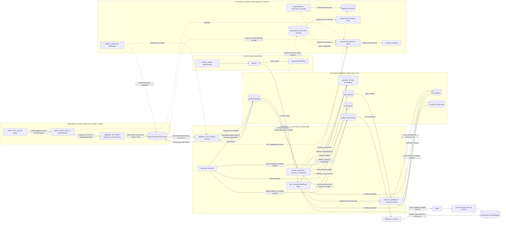

# Flujo completo de la primera entrega de producción

**Estado:** arquitectura adoptada por [ADR-015–019](decisions/README.md); historia en [ADR-010](decisions/ADR-010.md), [ADR-011](decisions/ADR-011.md), [ADR-013](decisions/ADR-013.md) y [ADR-014](decisions/ADR-014.md). [S00](../development/slices.md#s00) conserva el modelo previo y su decisión provisional histórica; [S17](../development/slices.md#s17) valida la ruta integrada con datos representativos. Ni capacidad ni continuidad están demostradas todavía.

Las flechas continuas son datos y acciones; las punteadas son operación. Cada sonda conserva IDs hasta ACK y dimensiona su spool para **al menos 4 h a su tasa sostenida más una ráfaga 5× de 15 min**, con margen estimado en S00. Si se agota, el descarte se contabiliza y alerta. El worker confirma sesión, metadatos, marcado y outbox en una transacción PostgreSQL. Kafka y Elasticsearch quedan fuera del ACK; revisiones semánticas, barreras persistentes y reconciliación toleran caída/replay. Los inválidos se aíslan y los pendientes siguen siendo reintentables.

La API, ingestión y worker comparten módulos de dominio, aunque pueden escalarse por proceso. OIDC identifica personas; mTLS identifica sondas. La consulta de más de 24 h hasta 30 días requiere sitio/sonda e IP de un extremo, con cursor, página máxima 100 y timeout ≤ 10 s. La [matriz de acceso](../product/functional-scope.md#matriz-de-acceso) rige cada operación.

PostgreSQL es autoridad adoptada. **S17 requiere corregir y reensayar la ruta** si no cumple los objetivos y coste de [ADR-013](decisions/ADR-013.md); ese cambio requiere ADR y evita dos históricos autoritativos permanentes. La continuidad adoptada requiere HA y réplica más copia base y WAL externos: una réplica no sustituye una copia. La conmutación y PITR se demuestran en S16–S17. El receptor, la guardia y la CA se inventarían y asignan antes de producción; [ADR-011](decisions/ADR-011.md) explica cuándo Prometheus o Grafana cubrirían una carencia real.
