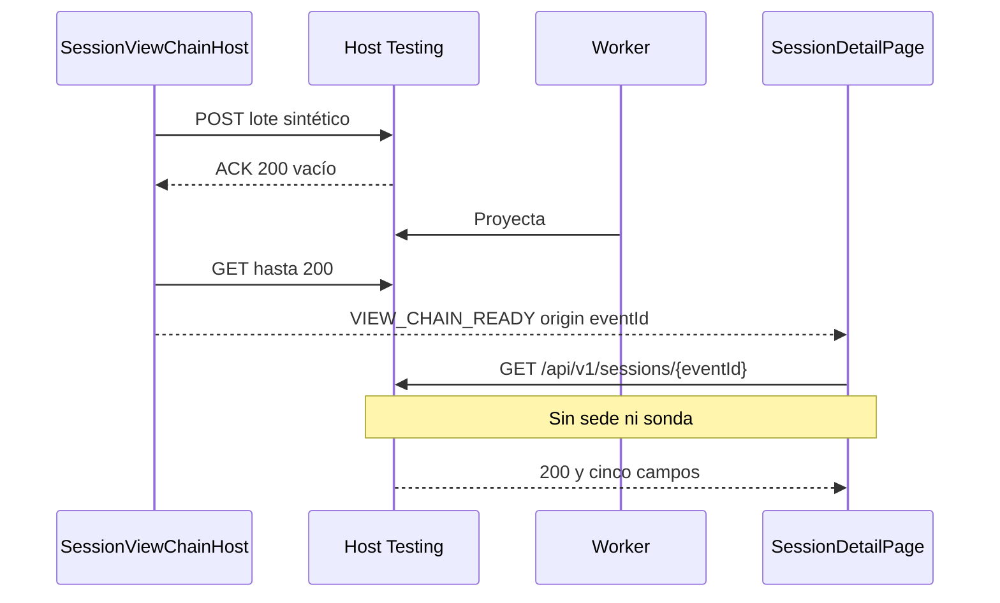

# Diseño: Vista Angular del detalle de sesión

Modo `design-after-spec`. La vista es cliente de `GET /api/v1/sessions/{eventId}`. Domain no referencia la SPA. Queda confirmada `sdd-propose-001`: `@angular/build:unit-test` renderiza el GET real contra un host Testing, sin Playwright.

## Technical Approach

`src/monitoring-web/` se crea con el CLI 22.2.0 y no entra en `Monitoring.slnx`. El proxy de `ng serve` reenvía `/api` a `http://127.0.0.1:5080` sin añadir ámbito. El host no llama a `UseStaticFiles`; el publish no copia la SPA.

`/sessions/:eventId` carga `SessionDetailPage`. El shell (`AppComponent`) es cabecera compacta y barra plegable con un ítem, «Detalle», más bajo que la ficha. Sin listado no hay panel de 320–440 px; sin portada. S09 queda fuera.

En Development o Testing, un middleware instala `ITrustedSessionReadContextFeature` desde configuración. `SessionEndpoint` conserva el guard. Sin las dos claves, o en otro entorno, el detalle sigue en 401.

## Architecture Decisions

### Decision: SPA Angular 22.2.0 fuera del host

**Choice**: CLI `22.2.0`, npm y `@angular/build:unit-test`.
**Alternatives considered**: CLI global 21.2.10; estáticos en el host; Playwright o un Vitest aparte.
**Rationale**: npm publica `@angular/core`, `@angular/cli` y `@angular/build` en `22.2.0`. El `ng` global es 21.2.10. Node `24.16.0` cumple `^22.22.3 || ^24.15.0 || >=26`.
**Evidence and consequences**: ADR-001. Generar con `npx --yes @angular/cli@22.2.0`. CI gana Node y lockfile. La UI no se publica. CSS propio, sin otro kit.

### Decision: Ámbito solo desde configuración del servidor

**Choice**: middleware con `TrustedSessionRead:SiteId` y `TrustedSessionRead:SensorId`, solo en Development o Testing. Los dos valores, sin espacios, o no hay feature.
**Alternatives considered**: cabeceras o query; el mismo puente en Production; OIDC ahora.
**Rationale**: el proveedor actual solo lee el feature y `Program.cs` no lo instala. La spec prohíbe que la petición fije el ámbito.
**Evidence and consequences**: ADR-002. `CreateHost` sigue sustituyendo el proveedor. Mvc.Testing 10.0.12 arranca en Development: sin claves no hay worker (`HostStartupTests`). Sin `appsettings` de ámbito, el arranque vacío sigue en 401.

### Decision: Ficha densa y cromado bajo

**Choice**: shell bajo y ficha con los cinco campos. `DESIGN.md` sale de `assets/DESIGN.template.md` de `linear-attio-ui`, sin activos de marca.
**Alternatives considered**: inspector lateral; portada.
**Rationale**: el híbrido separa cromado y datos. El inspector pide un listado que este slice no tiene.
**Evidence and consequences**: no es ADR. Neutros, un acento, texto de estado y color solo de apoyo. Cuerpo 13–14 px, título 18–24 px, filas 32–40 px. Botones nativos.

## Data Flow



El arnés usa `PostgresFixture` y `CreateAsync`, sustituye solo `ITrustedSensorIdentityProvider` y no llama a `ProjectAsync`. ACK distinto de 200 vacío: sale 1. Espera 10 s, como `WaitAsync`, al GET 200. `UseKestrel(0)` (Mvc.Testing 10.0.12) va antes de `CreateClient`; el origen es su `BaseAddress`. `Server` no vale con Kestrel. El spec, desde la raíz que contiene `Monitoring.slnx`, lanza `dotnet run --project tests/Monitoring.Tests --no-build -- --view-chain` y espera `VIEW_CHAIN_READY` hasta cerrar stdin.

La vista sale de `computed()`, sin `effect()`. Solo 404 es vacío; 401, red u otro fallo es error y no pinta campos. `occurredAt` se muestra igual que en el JSON. Textos: «Consultando detalle», «Sesión en ámbito», «No hay sesión en este ámbito», «No se pudo consultar el detalle». «Reintentar consulta» repite el GET. Enter y Espacio llaman a esa acción: jsdom no convierte la tecla en `click`.

## File Changes

| Ruta | Acción | Descripción |
|---|---|---|
| `src/monitoring-web/` | Crear | SPA, ruta, proxy y `styles.css` |
| `src/monitoring-web/src/app/app.component.ts` | Crear | Shell y `router-outlet` |
| `src/monitoring-web/src/app/session-detail/session-detail-page.component.ts` | Crear | Ficha, estados y botón |
| `src/monitoring-web/src/app/session-detail/session-detail-api.ts` | Crear | Contrato y GET |
| `src/monitoring-web/src/app/session-detail/*.spec.ts` | Crear | Estados, teclado y cadena |
| `DESIGN.md` | Crear | Semilla visual |
| `src/Monitoring.Host/Sessions/TrustedSessionReadScope.cs` | Crear | Opciones y middleware |
| `src/Monitoring.Host/Program.cs` | Modificar | Registro solo en Dev/Testing |
| `tests/Monitoring.Tests/TrustedSessionReadScopeTests.cs` | Crear | Config, 401, 404 y petición |
| `tests/Monitoring.Tests/SessionViewChainHost.cs` | Crear | `Main` de `--view-chain` |
| `tests/Monitoring.Tests/Monitoring.Tests.csproj` | Modificar | `GenerateProgramFile` false y `StartupObject` |
| `.github/workflows/ci.yml` | Modificar | Node 24.16.0, npm, publish |
| `openspec/config.yaml` | Modificar | Capacidad Angular, npm y puerta `ui` |
| `README.md` | Modificar | Proxy, variables y no publicación |
| `.gitignore` | Modificar | Dependencias y `dist`; el lockfile se versiona |

`SessionEndpoint`, Domain y Persistence no cambian.

## Interfaces / Contracts

```text
TrustedSessionRead:SiteId
TrustedSessionRead:SensorId
```

También `TrustedSessionRead__SiteId` y `TrustedSessionRead__SensorId`. El middleware hace `Set` con ese par y no lee la petición. Fuera de Development y Testing no se registra.

```typescript
export interface SessionDetail {
  eventId: string;
  siteId: string;
  sensorId: string;
  occurredAt: string;
  data: unknown;
}
```

`GET ${origin}/api/v1/sessions/${encodeURIComponent(eventId)}` sin params ni cabeceras de ámbito. `origin` vacío usa el proxy. `SESSION_DETAIL_API_ORIGIN` solo lo pone la cadena. CamelCase, como `SessionHostTests`. Controles: `<button type="button">` con `click`, `keydown.enter` y `keydown.space`.

## Testing Strategy

Strict TDD. Estados con `HttpTestingController`. La cadena usa `provideHttpClient()` (fetch) y no el doble. `npm test` ejecuta `ng test --watch=false`, sin `browsers`. `beforeAll`: 120 s. Dato: `SyntheticSessionContractTests.ValidData`.

| Escenario | Asignación |
|---|---|
| vista-001 encontrada | Página y cadena: éxito y cinco valores |
| vista-002 ausente | Página: 404, vacío, sin ficha |
| vista-002 otro ámbito | Scope: 404 sin cuerpo ajeno; página: vacío |
| vista-003 sin contexto o entorno | Scope: 401, lector sin llamadas, feature nulo en Production; página: error |
| vista-003 red | Página: status 0 u otro no-404, error, sin ficha |
| vista-004 sin ámbito | Sin `X-Site-Id`, `X-Sensor-Id` ni query; el servidor usa la config |
| vista-004 teclado | Cada `button`: Enter y Espacio activan su acción |
| vista-005 tres estados | Página: 200, 404 y 401 o red |
| vista-005 fixture hasta la vista | Arnés POST, ACK, worker; la ficha pinta el GET real |
| vista-005 CI | Fallo de página o cadena rompe `ci.yml` y la puerta `ui` |
| vista-005 sin publicación | `dotnet publish` del host sin `wwwroot` ni `monitoring-web` |
| ambito-003 config | Theory Dev/Testing, proveedor real, 200 y cinco campos |
| ambito-003 otra petición | Cabeceras y query no cambian el par configurado |
| ambito-003 Production | 401; sonda tras `next` ve el feature nulo |
| ambito-003 sin config | Dev o Testing, 401 |
| ambito-001 encontrada, ausente, mismo id | `SessionHostTests` ya cubre el proveedor sustituido |

La puerta `ui` queda `npm --prefix src/monitoring-web test`, `required: true`, `on_fail: halt`, `timeout_ms: 300000`. `commands.test` sigue en `dotnet test Monitoring.slnx`. Capacidad `angular` `22.2.0` y `npm` en `package_managers`.

## Migration / Rollout

Sin migración ni bandera: sin las dos claves no hay ámbito. CI, job de 15 min: Node `24.16.0` con caché, `dotnet test`, `npm ci`, `npm test`, publish y la comprobación del árbol. El arnés reutiliza la imagen PostgreSQL que ya baja la suite.

Reversión: quitar la SPA, `DESIGN.md`, el middleware y su llamada, el arnés, el paso Node y la puerta `ui`. El guard de S03 deja el 401.

## Open Questions

Ninguna.
